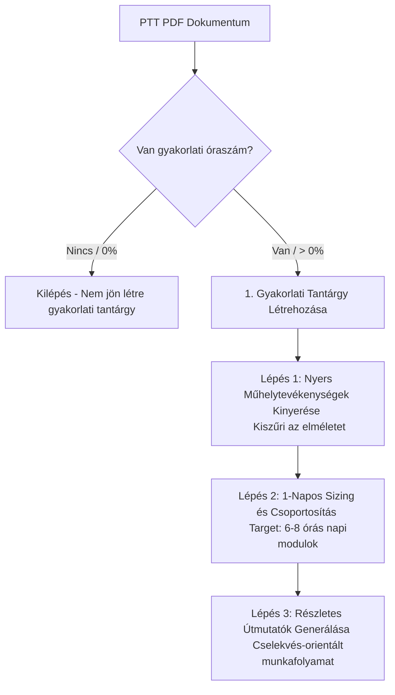

# 🛠️ 1-Napos Gyakorlati Tananyag Méretezési és Kinyerési Logika (1-Day Practical Sizing Pipeline)

Ez a dokumentum részletezi a gyakorlati tantárgyak és modulok **1 műhelynap (kb. 6-8 óra gyakorlat) = 1 gyakorlati modul** elvű kinyerési és méretezési logikáját. 

A gyakorlati oktatásban ez a logika garantálja, hogy a tanuló ne 1-órás elaprózott leckéket kapjon, hanem egy teljes napi összefüggő projektfeladatot, mérést vagy beállítást sajátítson el a műhelyben, szigorúan lekövetve a valós ipari műhelynapok ütemezését.

---

## 📐 A Gyakorlati Kinyerés Alapelvei

A gyakorlati tananyagok kinyerése egy speciális, **3-lépcsős szűrőn és méretezési folyamaton** megy keresztül:

1. **Nyers Műhelytevékenységek Kigyűjtése (Step 1):** Az AI először kizárólag a fizikai, kézzel fogható, műhelyben elvégezhető gyakorlati feladatokat és méréseket gyűjti ki a PTT leírásból, kiszűrve minden elméleti sallangot.
2. **1 Műhelynapos Tanulási Egységekre Tervezés (Step 2):** A kigyűjtött elemeket az AI szekvenciálisan csoportosítja olyan méretű modulokba (napokba), amelyeket a tanuló **pontosan 1 műhelynap (6-8 óra gyakorlat)** alatt reálisan meg tud tanulni és el tud végezni. A modulok automatikusan a `"Nap X: [Cím]"` formátumot kapják.
3. **Részletes Gyakorlati Útmutatók Generálása (Step 3):** Minden egyes napi egységhez az AI felépít egy precíz, cselekvés-orientált, felszólító módban írt 6-8 lépéses munkafolyamat leírást (Munkavédelem $\rightarrow$ Kalibrálás & Anyagelőkészítés $\rightarrow$ Főműveletek $\rightarrow$ Utóműveletek $\rightarrow$ Minőségellenőrzés $\rightarrow$ Rendrakás & Szakmai Adminisztráció).

---

## 🔄 A Gyakorlati Kinyerési Pipeline Folyamata



---

## 🛠️ Részletes Lépések és Algoritmus

### Lépés 1: Nyers Műhelytevékenységek Kigyűjtése
A rendszer kivonja a PTT szövegéből a gyakorlati megmunkálási, mérési vagy szerelési műveleteket. Az AI feladata, hogy letisztítsa és összegyűjtse az elvégzendő fizikai tevékenységeket.
*   **Prompt**: `buildWorkshopActivityExtractionPrompt()`
*   **Kimenet**: Nyers tevékenységek listája.

### Lépés 2: 1-Napos Tanulási Egységekre Tervezés (Sizing)
A kigyűjtött nyers tevékenységeket az AI szekvenciálisan egymásra épülő napi csomagokká rendezi át. Minden modul pontosan 1 műhelygyakorlati nap (kb. 6-8 óra gyakorlat) anyagát tartalmazza.
*   **Prompt**: `buildWorkshopDaySizingPrompt()`
*   **Modul formátuma**: `"Nap X: [Cím]"` (pl. *"1. nap: Kéziszerszámok biztonságos használata és fémfűrészelés alapjai"*).

### Lépés 3: Részletes Gyakorlati Útmutatók Generálása
Minden naphoz létrejön egy cselekvés-orientált útmutató, ami végigvezeti a diákot az ipari munkafolyamaton.
*   **Prompt**: `buildPracticalDayContentPrompt()`
*   **Struktúra**: 
    1.  *Munkavédelem és biztonsági ellenőrzések*
    2.  *Kalibrálás és anyagelőkészítés*
    3.  *Főműveletek és megmunkálás*
    4.  *Utóműveletek és tisztítás*
    5.  *Minőségellenőrzés (mérés, vizuális ellenőrzés)*
    6.  *Rendrakás és szakmai adminisztráció*

---

## 🤖 AI Prompt Gyakorlati Irányelvek

Az [ikk-service.ts](file:///e:/Antigravity_projektek/InteractiveLearning/server/ikk-service.ts) fájl gyakorlati modul generálási promptjai szigorúan ezt a 3-lépcsős napi struktúrát kényszerítik ki.

### Sizing Prompt Szabály (`buildWorkshopDaySizingPrompt`):
```markdown
1. Csoportosítsd és strukturáld ezeket a tevékenységeket egymásra épülő, szekvenciális egységekre (modulokra).
2. KÖTELEZŐ 1 NAPOS MÉRETEZÉS: Minden egyes egység (modul) pontosan akkora méretű legyen, amit egy tanuló 1 műhelygyakorlati nap (kb. 6-8 óra gyakorlat) alatt reálisan meg tud tanulni és el tud végezni a műhelyben!
3. Adj minden napnak egy vonzó, szakmailag pontos "Nap [X]: [Cím]" formátumú nevet.
```

---

## 💾 Rendszerszintű Előnyök

*   **Valós Ütemezés:** A modulok tökéletesen lefedik a szakiskolai gyakorlati oktatási napokat, így a tanár közvetlenül a napi elvégzett feladatok szerint tud osztályozni és haladni.
*   **Áttekinthető Projektek:** A diákok nem aprózódnak el 45 perces elméletinek tűnő gyakorlati leckékben; minden modul egy valós, kézzel fogható napi projektet vagy műhelymunkát takar.
