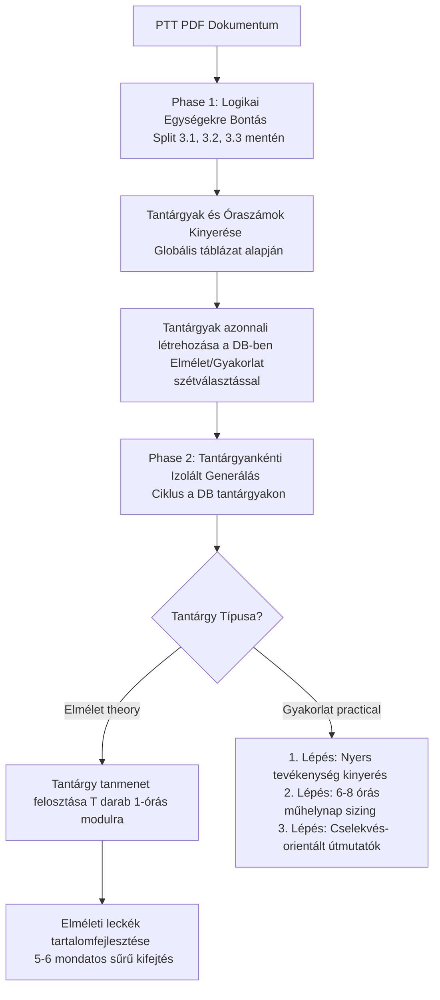

# 🛠️ Kétfázisú IKK Import és Gyakorlati Tananyag Pipeline (Two-Phase IKK Import Pipeline)

Ez a dokumentum részletezi a programtantervek (PTT) kinyerésének új, **kétfázisú, tantárgy-izolált és napi műhelysztenderdekre méretezett** pipeline-ját.

---

## 📐 A Kétfázisú Pipeline Architektúrája

A korábbi egyfázisos (ahol a tantárgyak és leckék kinyerése egyszerre, karakteralapú darabolással történt) modellt felváltotta egy jóval robusztusabb, **kétfázisú feldolgozási struktúra**:

---

## 🔄 Részletes Fázisok és Algoritmus

### 1. FÁZIS: Struktúra Elemzés és Adatbázis Váz Felépítése
Ebben a fázisban a rendszer a PTT szerkezetét térképezi fel és létrehozza a tantárgyakat az adatbázisban a modulok kifejtése előtt:
1.  **Logikai darabolás (Logical Split):** A PTT szövegét nem karakterhossz szerint, hanem a fő szakmai fejezetek (`3.1`, `3.2`, `3.3`, stb.) mentén bontjuk szét.
2.  **Szakma AI Elemzés:** Az AI elemzi a fejezeteket a PTT elején található globális óraszám-összesítő táblázattal együtt. Kigyűjti a tantárgyak nevét, kódját (pl. `3.1.1`), elméleti/gyakorlati óraszámait és százalékos arányait. Ebben a lépésben **nem generálunk modulokat**.
3.  **Split Tantárgyak Létrehozása:** A kinyert adatok alapján a rendszer azonnal létrehozza a tantárgyakat a DB-ben:
    *   Ha egy tantárgynak van elméleti óraszáma, létrejön egy `theory` típusú tantárgy (pl. *Gépészeti alapismeretek*).
    *   Ha van gyakorlati óraszáma, létrejön egy külön `practical` típusú tantárgy is (pl. *Gépészeti alapismeretek gyakorlat*).
4.  **Adminisztrációs mérföldkő:** A tantárgyi struktúra azonnal megjelenik az adatbázisban, és a háttérfolyamat kiszámítja a pontos teljes modul-célkitűzést a progress-barhoz.

### 2. FÁZIS: Tantárgyankénti Izolált Generálás (Phase 2)
A rendszer végigmegy a DB-ben létrehozott tantárgyakon egyesével. Mivel a tantárgyakat külön kezeljük, **kizárt a tantárgyak közötti modul-átfedés (cross-contamination)**:

#### A. Elméleti tantárgyak feldolgozása:
1.  **Tanmenet felosztása:** Az AI felosztja a tantárgy PTT szövegét pontosan `T` darab 1-órás modulra/leckére (ahol `T` az elméleti óraszám).
2.  **Granuláris tartalomfejlesztés:** A leckéket 4-es csoportokban elküldjük az AI-nak, ami legenerálja a sűrű, 5-6 mondatos elméleti kifejtést hozzájuk.

#### B. Gyakorlati tantárgyak feldolgozása (3-Step Daily Pipeline):
1.  **Nyers Műhelytevékenységek Kigyűjtése (Step 1):** Kivonjuk a PTT szövegéből a fizikai megmunkálási, mérési vagy szerelési műveleteket.
2.  **1-Napos Sizing (Step 2):** A kigyűjtött nyers tevékenységeket szekvenciálisan egymásra épülő napi csomagokká rendezzük. Minden modul pontosan 1 műhelygyakorlati nap (kb. 6-8 óra gyakorlat) anyagát tartalmazza, `"Nap X: [Cím]"` formátumban.
3.  **Részletes Gyakorlati Útmutatók Generálása (Step 3):** Minden naphoz cselekvés-orientált, 6 lépéses útmutatót generálunk (Munkavédelem $\rightarrow$ Kalibrálás $\rightarrow$ Főműveletek $\rightarrow$ Utóműveletek $\rightarrow$ Minőségellenőrzés $\rightarrow$ Rendrakás).

---

## 🤖 AI Promptok és Szabályok

A generálási szabályok és prompt sablonok a [server/ikk-service.ts](file:///e:/Antigravity_projektek/InteractiveLearning/server/ikk-service.ts) fájlban érhetőek el, míg a fázisvezérlést a [server/routes/ikk.ts](file:///e:/Antigravity_projektek/InteractiveLearning/server/routes/ikk.ts) végzi.

---

## 💾 Rendszerszintű Előnyök

*   **Garantált Nulla Átfedés:** A tantárgyak izolációja miatt lehetetlen, hogy hegesztési feladatok kerüljenek egy nyelvtanfolyam moduljai közé.
*   **Tökéletesen Kiszámítható Haladás:** A progress bar pontosan tudja az elméleti órák és becsült műhelynapok összegét, így zökkenőmentesen és valósághűen növekszik.
*   **Rendkívül Alacsony Memóriaigény:** Mivel egyszerre mindig csak egyetlen tantárgy moduljait tartjuk a memóriában feldolgozás alatt, a szerver RAM-igénye stabilan 200 MB alatt marad (ideális a 512 MB-os ingyenes felhős korlátokhoz).
*   **Hibamegkerülés és Resumability:** Ha az importálás megszakad, az ismételt indításkor a meglévő modulok másodpercek alatt átugrásra kerülnek, így a folyamat zökkenőmentesen folytatódik.
