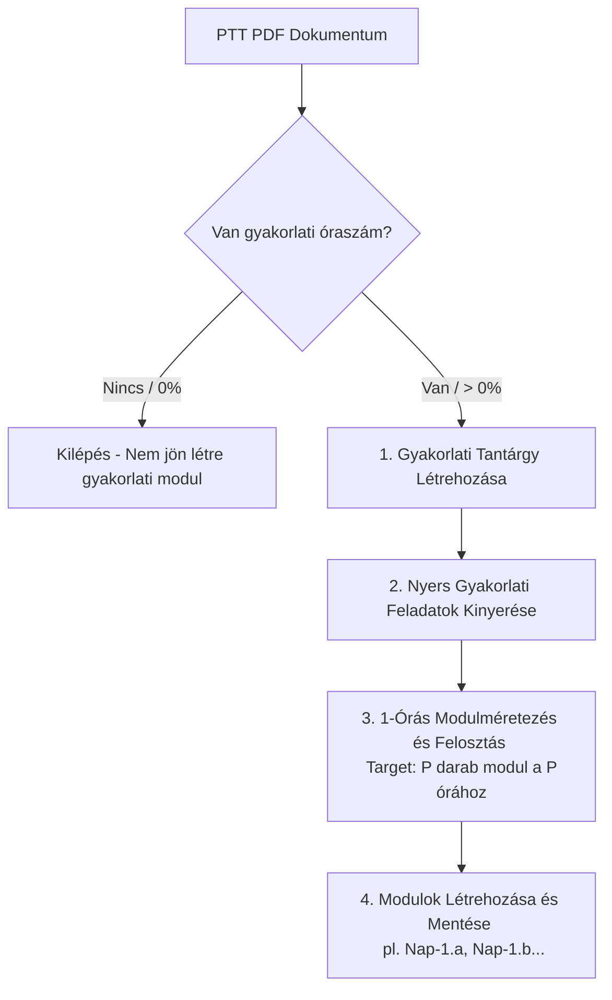

# 🛠️ 1-Órás Gyakorlati Tananyag Méretezési és Kinyerési Logika (1-Hour Practical Sizing Pipeline)

Ez a dokumentum részletezi a gyakorlati tantárgyak és modulok újradefiniált, **1 tanóra = 1 gyakorlati műveleti modul** elvű kinyerési és méretezési logikáját. 

A gyakorlati oktatásban ez a logika garantálja, hogy a tanuló minden egyes tanórában egy konkrét, jól elkülöníthető fizikai műveletet, mérést vagy beállítást sajátítson el a műhelyben, szigorúan követve az ipari munkafolyamatokat.

---

## 📐 A Gyakorlati Kinyerés Alapelvei

A gyakorlati tananyagok kinyerése egy 3-lépcsős szűrőn és méretezési folyamaton megy keresztül:

1.  **Óraszám Ellenőrzés (Praktikussági Szűrő):** Első lépésként a rendszer megvizsgálja, hogy a tantárgynak van-e gyakorlati óraszáma. Ha nincs, a gyakorlati ág nem jön létre.
2.  **Tananyag / Tantárgy Létrehozás:** Amennyiben a gyakorlati óraszám $P > 0$, a rendszer automatikusan létrehozza a gyakorlati tantárgyat az adatbázisban.
3.  **1-Órás Granuláris Felbontás:** A nyers gyakorlati feladatleírásokat pontosan $P$ darab, egymásra épülő, 1-órás gyakorlati modulra osztja fel a rendszer.

---

## 🔄 A Gyakorlati Kinyerési Pipeline Folyamata



---

## 🛠️ Részletes Lépések és Algoritmus

### 1. Gyakorlati Óraszám Ellenőrzése (Check Step)
A rendszer két módon határozza meg, hogy létezik-e gyakorlati óraszám:
*   **A `.4`-es pont alapján:** Megvizsgálja a `3.X.Y.4` pontot. Ha a gyakorlati arány nagyobb, mint 0% (pl. *"legalább 60%-át gyakorlati helyszínen kell lebonyolítani"*), akkor kiszámolja a gyakorlati órákat a teljes óraszámból:
    $$P = \text{Teljes Óraszám} \times \text{Gyakorlati Arány}$$
*   **Táblázat alapján:** Ha a PTT táblázatában külön oszlopban vagy sorban szerepelnek gyakorlati órák (pl. *1. évfolyam gyakorlati óraszáma*), akkor közvetlenül azt az értéket ($P$) veszi figyelembe a rendszer.

### 2. A Tananyag / Tantárgy Létrehozása (Creation Step)
Ha a kiszámított vagy beolvasott gyakorlati óraszám $P > 0$:
1.  Létrejön a tantárgy rekordja az adatbázisban `type: 'practical'` megjelöléssel (pl. *Villamos biztonságtechnika gyakorlat*).
2.  A tantárgy `hours` mezőjébe beírásra kerül a teljes gyakorlati óraszám ($P$).

### 3. Az 1-Órás Gyakorlati Modulméretezés (Sizing Step)
A gyakorlati oktatásban a **1 tanóra = 1 modul** elv azt jelenti, hogy minden modulnak egy **konkrét, 45-60 perc alatt biztonságosan elvégezhető műhelyfeladatot** kell leírnia.

Ha a témakör vagy tantárgy gyakorlati óraszáma $P$ (pl. **18 óra**):
*   A rendszer kigyűjti a PTT szöveges részéből az összes gyakorlati tevékenységet, szerszámot és munkaműveletet.
*   Az AI-nak a kigyűjtött nyers elemekből pontosan **18 darab**, egymásra épülő gyakorlati lépést kell terveznie.
*   **Kódolás:** A gyakorlati modulok kódja követi az elméleti mintát: `3.X.Y.Z.a`, `3.X.Y.Z.b`, stb., és az adatbázisban a `suggestedHours` értéke **`1`** lesz.

---

## 📝 Gyakorlati Példa: A Tartalom Szétosztása

Nézzük meg, hogyan bontja szét az AI a *Villamos biztonságtechnika* tantárgy gyakorlati óráit (pl. **6 óra keret**) önálló, 1-órás műhelymodulokra:

### Nyers Gyakorlati PTT Leírás:
> *Munkavédelmi előírások villamos környezetben. Egyéni védőeszközök kiválasztása és ellenőrzése. Szigetelt kéziszerszámok használata. Feszültségmentesítés 5 biztonsági lépése. Feszültségmentes állapot ellenőrzése kétpólusú feszültségkémlelővel. Földelés és rövidre zárás.*

### Generált 1-Órás Gyakorlati Modulok (P = 6):

| Modul Kód | Modul Címe | Műhelytevékenység & Munkamenet (1 óra) |
| :--- | :--- | :--- |
| **`3.1.2.6.4.a`** | 1. óra: Védőfelszerelések és környezet | Egyéni védőeszközök (EVE) kiválasztása, ellenőrzése (szigetelő kesztyűk, szőnyegek), munkaterület biztonságossá tétele. |
| **`3.1.2.6.4.b`** | 2. óra: Szigetelt szerszámok használata | A szigetelt kéziszerszámok (fogók, csavarhúzók) vizuális ellenőrzése, sérülések kiszűrése és szakszerű használata. |
| **`3.1.2.6.4.c`** | 3. óra: A feszültségmentesítés lépései | A feszültségmentesítés első három biztonsági lépésének gyakorlati végrehajtása a főkapcsolón és az elosztónál. |
| **`3.1.2.6.4.d`** | 4. óra: Feszültségmentesség ellenőrzése | Kétpólusú feszültségkémlelő (Duspól) kalibrálása, működés-ellenőrzése és a feszültségmentes állapot kimérése a munkaterületen. |
| **`3.1.2.6.4.e`** | 5. óra: Földelés és rövidre zárás | A földelő és rövidre záró felszerelések szakszerű felhelyezése a leválasztott hálózati szakaszra. |
| **`3.1.2.6.4.f`** | 6. óra: Visszakapcsolás és adminisztráció | A biztonsági eszközök szakszerű eltávolítása, a hálózat visszakapcsolása, valamint a munkalap/jegyzőkönyv kitöltése és rendrakás. |

> [!IMPORTANT]
> **A Gyakorlati Modulok Belső Felépítése:**
> Bár a modulok mindössze **1 óra** időtartamúak, mindegyiknek tartalmaznia kell az alábbi minimális lépéseket a leírásában (`practicalTasks`):
> 1.  *Munkavédelmi és szerszámellenőrzési lépés.*
> 2.  *A konkrét megmunkálási, mérési vagy szerelési művelet.*
> 3.  *Ellenőrzési és dokumentálási lépés.*

---

## 🤖 AI Prompt Gyakorlati Irányelvek

Az [ikk-service.ts](file:///e:/Antigravity_projektek/InteractiveLearning/server/ikk-service.ts) fájl gyakorlati modul generálási promptját az alábbi kiegészítéssel kell ellátni:

```markdown
── GYAKORLATI MODULOK MÉRETEZÉSE ÉS KINYERÉSE (KÖTELEZŐ SZABÁLY) ──
1. Vizsgáld meg, hogy a tantárgynak van-e gyakorlati óraszáma (P > 0). Ha van, hozz létre egy gyakorlati tantárgyat.
2. A szöveges PTT részből kinyert gyakorlati feladatokat bontsd fel pontosan P darab egymásra épülő, 1-órás műhelymodulra.
3. Minden egyes 1-órás modul képviseljen egy önálló fizikai lépést vagy részfeladatot (pl. anyagelőkészítés, mérés, egy adott varrattípus elkészítése).
4. Ha a gyakorlati óraszám magas (pl. 36 óra), bontsd szét a feladatokat a legkisebb elemi műveletekre (pl. fúrás átmérő szerint, menetvágás méret szerint, kalibrálás lépésenként).
5. Minden gyakorlati modulhoz pontosan 1 óra suggestedHours értéket rendelj, és a kód végére fűzz betűjelzést (pl. 3.1.2.6.4.a).
```

---

## 💾 Rendszerszintű Előnyök

*   **Tiszta Pedagógiai Egység:** Mind elmélet, mind gyakorlat esetén egységesen az **1 óra = 1 modul** elv érvényesül a teljes rendszerben, így a tanulói haladás nyomon követése (XP pontok, haladási százalékok) teljesen lineárissá válik.
*   **Órarend-szintű integráció:** A modulok azonnal megfeleltethetőek az iskolai tanóráknak és műhelynapoknak, így a tanárok közvetlenül naplózhatják az órákat a modulok alapján.
