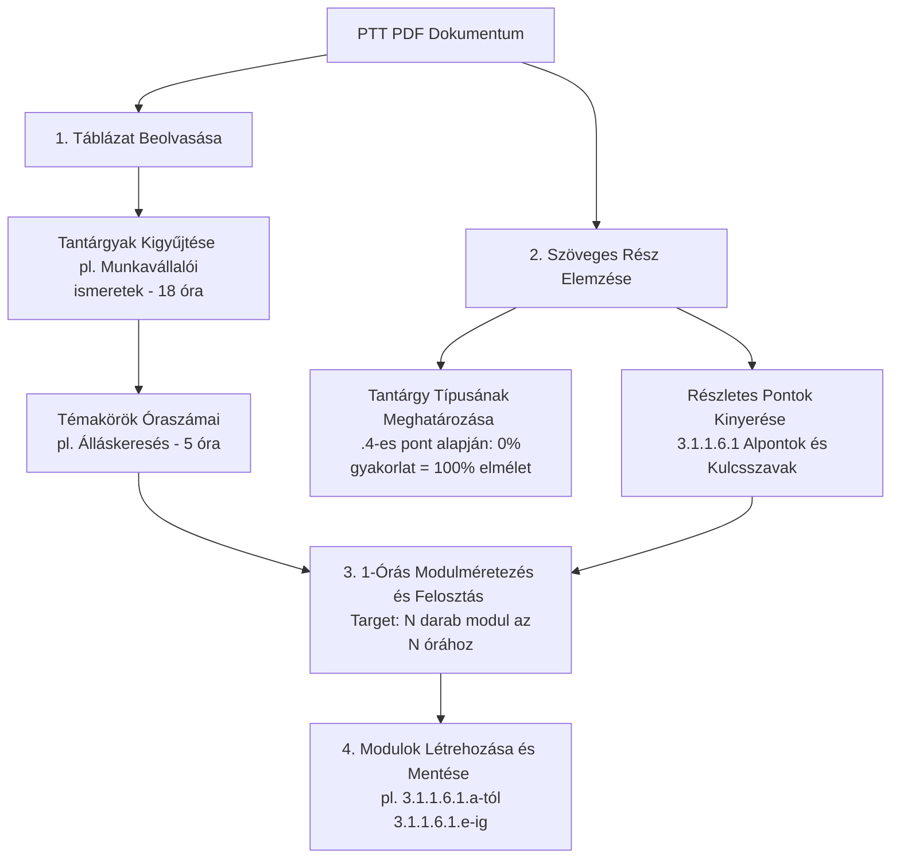

# 📘 1-Órás Elméleti Tananyag Méretezési és Kinyerési Logika (1-Hour Theory Sizing Pipeline)

Ez a dokumentum részletezi az elméleti tantárgyak és modulok újradefiniált, táblázatos és szöveges adatokon alapuló, **1 tanóra = 1 modul** elvű kinyerési logikáját. 

A rendszer a jövőben ezt a módszertant használja a hivatalos IKK Programtantervek (PTT) feldolgozásakor, biztosítva, hogy a diákok számára generált tanulási egységek pontosan lefedjék az előírt óraszámokat, és egyenletes terhelést biztosítsanak (45-60 perc tanulási idő modulonként).

---

## 📐 A Kétoldalú Megközelítés Alapelvei

A tananyagok kinyerése és struktúrájának felépítése két fő forrás szinkronizációjából történik:

1.  **Táblázatos megközelítés (Óraszám- és Témakeret):** A PTT elején található összesítő táblázat határozza meg a tantárgyak pontos óraszámait és a fő témakörök (modulcsoportok) óraszám-felosztását.
2.  **Szöveges megközelítés (Szakmai Tartalom):** A dokumentum későbbi részében található részletes leírások (pl. `3.1.1.6 A tantárgy témakörei`) adják meg azokat a kulcsszavakat, részterületeket és szakmai elvárásokat, amelyeket a táblázatban meghatározott óraszámú modulokba kell szétosztani.

---

## 🔄 A Kinyerési Pipeline Folyamata

Az alábbi ábra szemlélteti, hogyan hangolja össze a rendszer a táblázat óraszámait és a szöveges részleteket:



---

## 🛠️ Részletes Lépések és Logika

### 1. Tantárgy és Típus Azonosítása (Szöveg + Táblázat)
*   **Tantárgy azonosítása:** A rendszer megkeresi a szöveges részben a `3.X.Y [Név] tantárgy [óra] óra` formátumot (pl. `3.1.1 Munkavállalói ismeretek tantárgy 18/18 óra`).
*   **Gyakorlat/Elmélet Arány:** A tantárgy alatti **`.4`**-es alpontot vizsgálja a rendszer (pl. `3.1.1.4 A képzés órakeretének legalább 0%-át gyakorlati helyszínen kell lebonyolítani`).
    > [!NOTE]
    > Ha ez a szám **0%**, akkor a tantárgy **100% Elmélet (Theory)**. Minden ebből származó modul elméleti típusúként kerül mentésre.

### 2. Témakörök és Cél-óraszámok Kinyerése (Táblázat)
A rendszer a PTT táblázatából kinyeri az adott tantárgyhoz tartozó témaköröket és azok óraszámait.
*   **Példa (Munkavállalói ismeretek - 18 óra):**
    *   *Álláskeresés:* **5 óra**
    *   *Munkajogi alapismeretek:* **5 óra**
    *   *Munkaviszony létesítése:* **5 óra**
    *   *Munkanélküliség:* **3 óra**

### 3. Az 1-Órás Modulméretezési Szabály (Sizing Rule)
A legfőbb szabály: **Ahány óra van rendelve a témakörhöz a táblázatban, pontosan annyi darab, egymást követő elméleti almodulra kell azt felbontani.**

*   **Cél:** Ha a témakör óraszáma $N$, akkor abból pontosan $N$ darab modul jön létre ($Modul_1, Modul_2, \dots, Modul_N$).
*   **Kódolás:** A modulok megkapják a témakör kódját, a végén pedig ABC sorrendben egy-egy betűjelzést:
    *   `3.1.1.6.1.a`, `3.1.1.6.1.b`, `3.1.1.6.1.c`, `3.1.1.6.1.d`, `3.1.1.6.1.e` (Összesen 5 modul az 5 órához).

---

## 📝 Gyakorlati Példa: A Tartalom Szétosztása

Nézzük meg, hogyan osztja el az AI a szöveges részleteket **5 egyenlő, 1-órás modulra** a *Munkaviszony létesítése* témakörnél (5 óra keret):

### Nyers PTT Szöveges Forrás (`3.1.1.6.3`):
> *Felek a munkajogviszonyban. A munkaviszony alanyai. A munkaviszony létesítése. A munkaszerződés. A munkaszerződés tartalma. A munkaviszony kezdete létrejötte, fajtái. Próbaidő. A munkavállaló és munkáltató alapvető kötelezettségei. A munkaszerződés módosítása. Munkaviszony megszűnése, megszüntetése. Munkaidő és pihenőidő. A munka díjazása (minimálbér, garantált bérminimum).*

### Szétosztott 1-Órás Modulok (N = 5):

| Modul Kódja | Modul Címe | Szakmai Tartalom (Csoportosított Kulcsszavak) | Cél óraszám |
| :--- | :--- | :--- | :---: |
| **`3.1.1.6.3.a`** | 1. rész: A munkajogviszony alanyai és a munkaszerződés | Felek a munkajogviszonyban (alanyok), a munkaviszony létesítése, a munkaszerződés fogalma és kötelező tartalmi elemei. | **1 óra** |
| **`3.1.1.6.3.b`** | 2. rész: A munkaviszony kezdete, fajtái és a próbaidő | A munkaviszony tényleges kezdete, típusai (határozott/határozatlan), valamint a próbaidő kikötésének szabályai és célja. | **1 óra** |
| **`3.1.1.6.3.c`** | 3. rész: Jogok, kötelezettségek és a szerződés módosítása | A munkavállaló és a munkáltató alapvető kötelezettségei, valamint a munkaszerződés módosításának jogi feltételei. | **1 óra** |
| **`3.1.1.6.3.d`** | 4. rész: A munkaviszony megszűnése és megszüntetése | A munkaviszony megszűnésének (pl. elhalálozás) és megszüntetésének (közös megegyezés, felmondás, azonnali hatályú felmondás) esetei. | **1 óra** |
| **`3.1.1.6.3.e`** | 5. rész: Munkaidő, pihenőidő és a munka díjazása | A napi/heti munkaidőkeretek, pihenőidők, szabadságok, valamint a díjazás szabályai (minimálbér és garantált bérminimum). | **1 óra** |

> [!TIP]
> **Kiegyensúlyozás:** Ha a szövegben kevesebb információ van, mint a cél-óraszám (pl. 3 kulcsszó 5 órára), az AI köteles részletesebben kifejteni az elméleti hátteret, bemutatni a gyakorlati életből vett példákat, vagy külön modulban tárgyalni a jogi szabályozást és a hibalehetőségeket.

---

## 🤖 AI Prompt Módosítási Irányelvek

Az elméleti tananyag kinyerését végző [prompts.md](file:///e:/Antigravity_projektek/InteractiveLearning/docs/developer/prompts.md) vagy `ikk-service.ts` promptjait az alábbi instrukcióval kell kiegészíteni:

```markdown
── ELMÉLETI MODULOK MÉRETEZÉSE (KÖTELEZŐ SZABÁLY) ──
1. Keresd meg a tantárgyhoz tartozó összesítő táblázatot és olvasd ki a témakörök óraszámait (N).
2. Minden témakörhöz (pl. Témakör: Álláskeresés, Óraszám: 5 óra) pontosan N darab egymásra épülő almodult hozz létre.
3. A szöveges részben (pl. 3.1.1.6.1) található kulcsszavakat és leírásokat csoportosítsd logikusan úgy, hogy pontosan N darab kiegyensúlyozott, 1-órás tananyagot kapj.
4. Ha a forrásszöveg rövid, de az óraszám magas (pl. 3 óra), akkor se vonj össze modulokat! Ehelyett bontsd fel a meglévő témákat mélyebb elméleti alpontokra (pl. Alapfogalmak -> Részletes jogi háttér -> Gyakorlati esettanulmányok).
5. A modulok sectionCode mezőjének végére fűzz ABC sorrendben betűket: 3.1.1.6.1.a, 3.1.1.6.1.b, stb.
```

---

## 💾 Adatbázis és UI Megjelenítés

*   **Sorszámok tisztasága:** A modulok listázásakor a felhasználói felületen nem a nyers `sectionCode` (pl. `3.1.1.6.3.a`) jelenik meg sorszámként, hanem a tantárgyon belüli tiszta, növekvő sorrend (pl. *1. modul, 2. modul...*), a címben pedig jelezzük az óraszámot vagy a témát (pl. *“Munkaviszony létesítése - 1. rész”*).
*   **suggestedHours:** Minden így létrejött elméleti modul adatbázis rekordjában a `suggestedHours` mező alapértelmezetten **`1`** (óra) értéket kap, ami tökéletesen szinkronban van a tantárgy teljes óraszámával.
